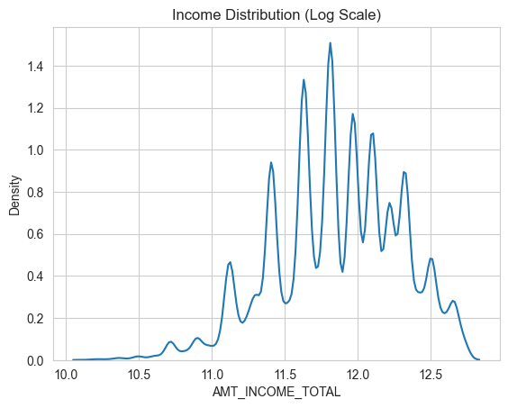
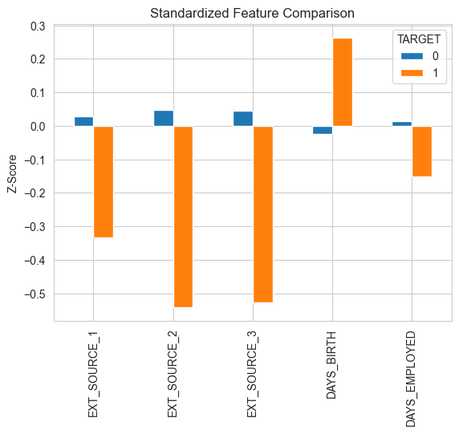
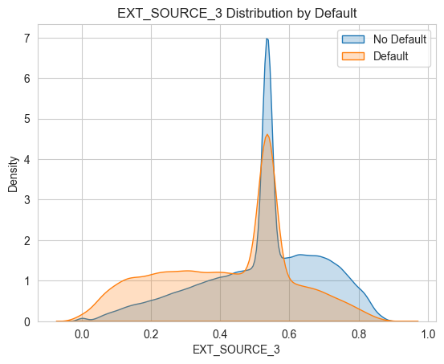

## 🔝 Top Predictors of Default

To identify the key drivers of loan default, we analyzed feature behavior across defaulters and non-defaulters using statistical comparison and visualization.

### Income Distribution in Dataset using KDE plot

➡️ This visulaization shows the Income Distribution in Log Scale of the applicants in the dataset, after removing outliers which shows a clearer central tendnecy.
However, it was found that income doesnt strongly differentiate between defaulters and non-defaulters, thus it was not inlcuded in the top predictors.

### 📊 Feature Importance 

➡️ This visualization shows the  difference in standardized feature values of the top predictors between defaulters and non-defaulter.

### EXT_SOURCE_1/2/3 KDE Plot

➡️ This visualization shows normalized distributions of the EXT_SOURCE_1/2/3 for the defaulters and the non defaulters.
It is evident that defaulters have consistently lower EXT_SOURCE scores.

---

## 💡 Key Insights

- **External credit scores (EXT_SOURCE_1, EXT_SOURCE_2, EXT_SOURCE_3)** are the strongest predictors of default risk  
- Lower EXT_SOURCE values are consistently associated with higher probability of default  
- **Age (DAYS_BIRTH)** shows that younger applicants tend to have slightly higher default risk  
- **Employment duration (DAYS_EMPLOYED)** indicates that stable employment reduces default probability  

➡️ Financial indicators are significantly more predictive than demographic or binary flag variables  

---

## 🚀 Business Impact

- Enables financial institutions to identify high-risk applicants early  
- Supports more accurate and data-driven loan approval decisions  
- Helps reduce financial losses due to defaults  
- Can be integrated into credit scoring systems for real-time risk assessment  

---

## 🧠 Key Takeaway

While simple correlation analysis provided initial insights, combining statistical comparison with domain understanding revealed that external credit scores are the most reliable indicators of default risk.
